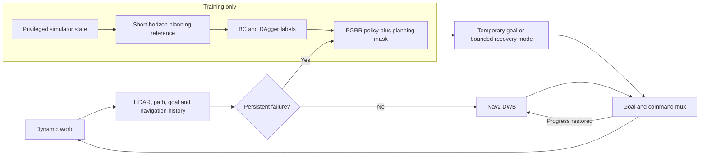

# PGRR: Planning-Guided Failure-Triggered Recovery and Rejoin for Dynamic Social Navigation

PGRR is a failure-triggered recovery layer for dynamic social navigation. Nav2
DWB remains in control during normal PointGoal navigation. PGRR activates only
when observable rules detect collision risk, freezing, oscillation, deadlock,
or planner failure; it then selects an interpretable temporary subgoal or
bounded recovery mode and returns control to the original route.

This repository presents **one supported final release**. The string
`moderate_social_navigation_v6` remains in scenario IDs and manifests because
it is the immutable identity of the evaluated dataset, not a second software
or algorithm version. Historical `ramp_*` and `RAMP_*` names are compatibility
interfaces only; the public method name is PGRR.

## Final release at a glance

- Frozen run: `95ec74c511bb` at evaluation commit
  `6916e7cd586acfbe200045e49b093039e2a6980e`.
- Complete evidence: 600/600 logical episodes, five methods, 120 identical
  held-out conditions per method.
- Selected model: [`checkpoints/final/best.onnx`](checkpoints/final/best.onnx),
  the validation-selected DAgger checkpoint.
- Paper: [`paper/main.pdf`](paper/main.pdf), exactly 8 pages.
- Technical report:
  [`report/PGRR_technical_report_zh.pdf`](report/PGRR_technical_report_zh.pdf),
  exactly 32 pages.
- Presentation:
  [`presentation/PGRR_report_zh.pptx`](presentation/PGRR_report_zh.pptx) and
  [PDF](presentation/PGRR_report_zh.pdf), exactly 30 illustrated slides/pages,
  including sourced DWB, BC, and DAgger explanations plus real run evidence.
- Checksummed release bundle:
  [`outputs/moderate/final/artifact_manifest.json`](outputs/moderate/final/artifact_manifest.json),
  96 bound artifacts, including the reproducible algorithm-figure sources.

| Method | Goal reached | Collision | Timeout | Planner failure |
|---|---:|---:|---:|---:|
| Base DWB | 85 | 35 | 0 | 0 |
| Standard Nav2 recovery | 81 | 39 | 0 | 0 |
| Heuristic recovery | 100 | 1 | 6 | 13 |
| Uniform BC | 104 | 1 | 5 | 10 |
| **PGRR** | **109** | **0** | **2** | **9** |

On the 120 paired Base--PGRR conditions, PGRR increases goal reaching by 20.00
percentage points (109/120 versus 85/120; global Holm-adjusted McNemar
`p=1.031e-4`) and reduces collision by 29.17 points (0/120 versus 35/120;
global Holm `p=2.561e-9`). The +1.67-point timeout difference has global Holm
`p=1`; the +7.50-point planner-failure difference is descriptive because that
terminal class was not a preregistered inferential endpoint.

The improvement has costs. On 83 joint-success pairs, PGRR is 15.88 s slower
and 1.89 m longer, and it has higher angular jerk. Its observed differences
from Heuristic and Uniform BC on the three preregistered terminal endpoints
(goal, collision, and timeout) are not significant after global correction;
planner failure is descriptive and was not post-hoc tested. The supported
claim is a safety and completion improvement over Base DWB with efficiency and
smoothness trade-offs—not universal social-navigation superiority.

## System

The recovery action set contains 21 robot-relative temporary goals from three
radii and seven bearings, plus `WAIT`, `BACKUP`, `REPLAN`, and `CONTINUE`. A
planning-derived mask removes unsafe, occupied, disconnected, occluded, or
unavailable choices. A hysteretic state machine saves the original task goal,
executes bounded recovery, and rejoins the Nav2 route after stable clearance
and task progress. An independent stopping-distance supervisor can override
both learned and classical commands; it is an empirical filter rather than a
formal safety guarantee.



At deployment, PGRR uses only LiDAR, path, goal, velocity, planner-command,
progress, status, and rule-score histories. Privileged robot/pedestrian state
is confined to the training expert and evaluation fields. PPO and a learned
failure detector are not completed contributions.

The architecture and recovery-state figures are
[`paper/figures/system_architecture.pdf`](paper/figures/system_architecture.pdf)
and
[`paper/figures/recovery_state_machine.pdf`](paper/figures/recovery_state_machine.pdf).

## Benchmark and comparators

The final held-out benchmark covers eight dynamic-interaction families:
head-on corridor, doorway bottleneck, crossing flow, blind corner, group
blocking, overtaking, opposite streams, and temporary blockage. Each appears
at low, medium, and high density. Five held-out repeats produce 120 shared
condition keys per method.

| Runner ID | Paper label | Role |
|---|---|---|
| `base` | Base DWB | Classical planner without recovery subtree |
| `standard` | Standard | Standard Nav2 recovery behavior |
| `heuristic` | Heuristic | Observable rule-triggered recovery |
| `bc_uniform` | Uniform BC | Planning-masked behavior cloning |
| `pgrr` | PGRR | Validation-selected DAgger recovery |

Train, validation, and test are split by scenario ID and seed, never by frame.
The test remained sealed until the configuration, compiled scenarios,
checkpoint, runtime, horizon, concurrency, and accepted calibration hash were
committed. The final test is now permanently frozen and cannot be used for
tuning.

## Real environment and run comparison

The release includes both kinds of evidence requested for a complete project:

- [Real Arena Gazebo GUI capture](paper/figures/runtime_gazebo_doorway_bottleneck_medium.png)
  with [pixel/runtime metadata](outputs/figures/runtime/gazebo_doorway_bottleneck_medium.metadata.json)
  and [window provenance](outputs/figures/runtime/gazebo_doorway_bottleneck_medium.window.json).
  It demonstrates Ubuntu 22.04, ROS2 Humble, Arena Gazebo, Jackal, Nav2 DWB,
  planar LiDAR, and dynamic agents. It is honestly labeled as a historical
  moderate-v5 validation environment capture (benchmark provenance, not
  another current release), not a camera frame from the held-out statistical
  run.
- [Matched Base--PGRR trajectory](outputs/moderate/final/media/moderate_matched_base_pgrr_trajectory.pdf)
  and [PGRR recovery timeline](outputs/moderate/final/media/moderate_pgrr_recovery_timeline.pdf)
  reconstructed from a real identical-condition held-out pair and bound to the
  raw/result hashes. These are telemetry reconstructions, not screenshots.
- [Representative telemetry keyframes](outputs/moderate/final/media/pgrr_representative_telemetry_keyframes.pdf)
  and [video](outputs/moderate/final/media/pgrr_representative_telemetry.mp4),
  also explicitly labeled as telemetry.

The paper, report, and slides contain actual outcome tables and paired
comparisons in addition to explanatory diagrams.

## Environments

Online and offline environments are deliberately separate:

| Environment | Purpose |
|---|---|
| Ubuntu 22.04 / ROS2 Humble / pinned Arena Gazebo | Jackal, Nav2, simulation, online inference, episode execution |
| Python 3.10 Conda `ramp-offline` | Data, expert labels, BC/DAgger, tests, statistics, figures, LaTeX |

The Gazebo profile uses deterministic LiDAR-visible cylindrical pedestrian
proxies. They enable reproducible paired interactions but are not a validated
model of human intent. Exact third-party provenance is in
[`third_party/arena_commits.lock`](third_party/arena_commits.lock) and
[`third_party/dependency_manifest.md`](third_party/dependency_manifest.md).

Never install or source Arena from an active Conda environment. Runtime helpers
remove Conda and foreign ROS variables; offline helpers do not source ROS.

## Install, build, and test

Run from the Git root:

```bash
PROJECT_ROOT="$(git rev-parse --show-toplevel)"
cd "$PROJECT_ROOT"

make preflight
make conda
make arena
make build
make test
```

- `make preflight` records a non-mutating environment report.
- `make conda` creates or updates the offline environment.
- `make arena` prepares the isolated pinned online runtime.
- `make build` installs Python packages and builds the ROS2 overlay.
- `make test` runs Ruff, formatting, mypy, and pytest.

For a bounded runtime check:

```bash
make smoke SEED=0 HEADLESS=1
```

Goal acceptance in smoke is an infrastructure check, not an algorithm result.

## Data and training

```text
Arena episode JSONL
  -> observable/privileged field separation
  -> expert-labelled HDF5 shards
  -> Uniform BC
  -> two DAgger rounds and validation selection
  -> final ONNX checkpoint
  -> five-method closed-loop evaluation
```

Representative training targets are:

```bash
make label-expert
make train-bc
make train-dagger DAGGER_ITERATION=1
make train-dagger DAGGER_ITERATION=2
```

The selected checkpoint is
[`checkpoints/dagger/coverage_safety_aligned/best.onnx`](checkpoints/dagger/coverage_safety_aligned/best.onnx),
also exposed at `checkpoints/final/best.onnx`. The second DAgger candidate and
margin weighting are retained as negative validation/offline results, not
silently promoted.

## Reproduce the release without simulation

The default publication rebuild uses only the checked-in final result bundle:

```bash
PGRR_RELEASE_MODE=0 PGRR_RECOLLECT_RAW=0 \
scripts/reproduce_paper.sh
```

It never starts Arena and never opens `data/raw`. It verifies the published
600-row inputs, regenerates result assets, builds the 8/32/30-page documents,
and creates a candidate artifact manifest.

After committing a complete candidate, validate it from a clean checkout:

```bash
PGRR_RELEASE_MODE=1 PGRR_RECOLLECT_RAW=0 \
scripts/reproduce_paper.sh
```

Release mode regenerates nothing. It checks scientific provenance, all 96
artifact paths/sizes/SHA256 values, canonical media hashes, page counts, final
paper text, report/PPT data structure, and privacy, then must leave the
checkout unchanged. Font embedding is checked during the development document
build whose resulting PDFs are then hash-bound by release mode. See
[`REPRODUCIBILITY.md`](REPRODUCIBILITY.md) and [`COMMANDS.md`](COMMANDS.md) for
the complete commands.

The 600-episode simulation is already complete. An intentional independent
rerun must use a clean worktree at the frozen evaluation commit and a new,
empty output directory:

```bash
git worktree add ../PGRR-evaluation-reproduction \
  6916e7cd586acfbe200045e49b093039e2a6980e
cd ../PGRR-evaluation-reproduction
make verify-calibration
test ! -e outputs/moderate/independent_reproduction
make evaluate-final \
  MODERATE_ANALYSIS_DIR=outputs/moderate/independent_reproduction
```

Algorithm outcomes (`GOAL_REACHED`, `COLLISION`, `TIMEOUT`, and
`PLANNER_FAILURE`) are never retried. Only explicitly classified
`SIMULATOR_FAILURE` and `INVALID_RESET` attempts may be retried, and every
physical attempt remains in the run provenance.

## Authoritative final layout

```text
configs/final/ei_gazebo.yaml
configs/experiments/scenario_catalog_moderate_v6.yaml
scenarios/splits/moderate_v6_test.yaml
checkpoints/final/best.onnx
outputs/moderate/v6_validation_base_d5fa66b/calibration_report.json
outputs/moderate/final/
  episode_manifest.parquet
  run_manifest.json
  results.parquet
  summary.csv
  pairwise_statistics.json
  failure_analysis.md
  matched_base_pgrr_evidence.json
  artifact_manifest.json
  media/
paper/main.pdf
report/PGRR_technical_report_zh.pdf
presentation/PGRR_report_zh.pptx
presentation/PGRR_report_zh.pdf
```

Only `outputs/moderate/final/` is authoritative for final result claims. Pilot,
smoke, calibration, validation, and historical directories cannot populate a
final table or figure. The accepted calibration report is named explicitly
above because an empty rejected test-stage byproduct with a similar basename
is not evidence.

## Repository map

```text
configs/       final runtime, planner, failure, training, and benchmark inputs
packages/      ROS-independent core and ML Python packages
ros_ws/src/    ROS messages, nodes, and bringup
scenarios/     compiled scenarios, previews, manifests, and split locks
data/          raw/intermediate data and provenance (large raw streams ignored)
checkpoints/   BC/DAgger models and metadata
scripts/       bootstrap, Arena, data, training, evaluation, and publication tools
outputs/       final evidence, figures, tables, logs, and retained audits
paper/         IEEE manuscript and generated assets
report/        detailed Chinese technical report
presentation/  PPTX/PDF, speaker notes, and contact sheet
tests/         unit, integration, and deterministic regression tests
```

## Limitations

- The evaluated domain uses one known map family, planar LiDAR, simulation
  localization, deterministic actor routes, and one classical planner.
- The 25-action set, observable trigger, and empirical supervisor provide no
  formal collision-avoidance guarantee.
- Closed-loop outcomes combine trigger, mask, learned policy, Nav2, simulator,
  and supervisor; they do not identify a causal contribution for one guard.
- PPO, a learned detector, Flatland, Arena 5, a second planner, cross-simulator
  transfer, hardware, human-subject validation, and formal safety are not
  completed claims.
- The frozen test cannot be used for further algorithm or threshold selection.

## Historical audit boundary

Scientific transparency requires one compact earlier boundary. A frozen 64/64
audit recorded PGRR/Base collisions of 0/24 versus 19/24, timeouts of 16/24
versus 0/24, and goal reaches of 8/24 versus 5/24; the adjusted goal-reaching
comparison was not significant. This safety--completion trade-off is not a v6
result and is never pooled with the final 600-episode evidence. A later
validation candidate was also rejected before its test was opened because
Base exceeded the preregistered calibration ceiling. Full details remain in
Git history and immutable manifests rather than being exposed as multiple
current project versions.

## Branches, citation, and license

`main` is the canonical release branch and `home` is a synchronized mirror of
the same final project state. Published evidence is never force-rewritten.

Citation metadata are in [`CITATION.cff`](CITATION.cff); verified references
are in [`paper/references.bib`](paper/references.bib). The software is released
under the [BSD 3-Clause License](LICENSE), while third-party Arena/ROS assets
retain their original licenses.
