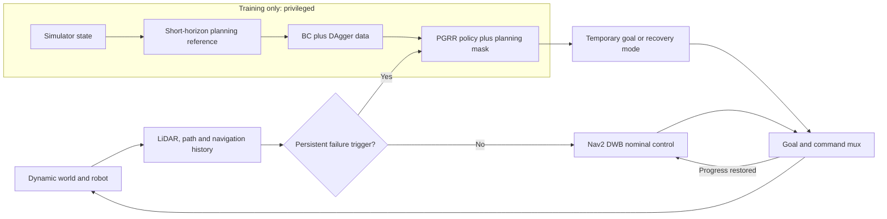

# PGRR: Planning-Guided Failure-Triggered Recovery and Rejoin for Dynamic Social Navigation

PGRR is a failure-triggered recovery layer for dynamic social navigation. A
classical ROS2 navigation stack controls routine PointGoal motion. Learning is
invoked only when observable rules indicate collision risk, freezing,
oscillation, deadlock, or planner failure. The learned policy selects an
interpretable temporary subgoal or recovery mode; it does not continuously
replace the local planner or command base velocity.

The release and paper name is exactly **PGRR: Planning-Guided
Failure-Triggered Recovery and Rejoin for Dynamic Social Navigation**.
Historical `ramp_*`/`RAMP_*` package, environment, and runtime identifiers are
compatibility interfaces, not the public method name.

> **Evidence status.** The selected release uses a privileged rollout expert,
> Uniform BC, a completed two-round DAgger workflow, planning/action masking,
> an observable rule trigger, and an independent safety supervisor. The
> validation-selected deployment checkpoint retrains the accepted DAgger
> aggregate with a train-only coverage shard; the second-round candidate was
> evaluated but not selected. PPO and a learned failure detector are not
> claimed as completed contributions. Final paper numbers are accepted only
> from the complete moderate-v6 five-method artifacts under
> `outputs/moderate/final/`; validation probes and previous evaluations are
> never copied into the paper. Moderate-v5 is retained as a rejected
> calibration audit and cannot be promoted into a v6 result snapshot.

The closed-loop evaluation is a five-method suite: four baselines plus the
PGRR main method. The baselines are DWB, Standard Nav2 recovery, deterministic
Heuristic recovery, and Uniform BC. PGRR is the validation-selected DAgger
policy with the same observable interface and planning mask. The privileged
expert is a training reference, not a fifth deployment baseline.

## Method

The recovery action set contains 21 robot-relative temporary goals from three
radii and seven bearings, plus `WAIT`, `BACKUP`, `REPLAN`, and `CONTINUE`. A
planning-derived mask removes occupied, disconnected, occluded, unsafe, or
unavailable actions before selection. A hysteretic state machine saves the
original task goal, executes bounded recovery, and rejoins the original Nav2
route after progress resumes. A stopping-distance supervisor can override both
learned and classical commands. It is an empirical safety filter, not a formal
collision-free guarantee.

The collision trigger applies immediate absolute/TTC checks in the narrow
task-forward sector. Off-axis returns require 0.5 s of bearing-consistent
closing evidence after accounting for ego motion, avoiding a persistent false
trigger from a static corner shelf. The independent control-rate supervisor is
unchanged by that rule: translation uses a 0.48 m footprint stop threshold,
while bounded in-place turns use a separate 0.40 m swept-radius threshold for
the 0.36 m circular evaluation footprint.

The selected timing is fully bounded: decisions run at 2 Hz and control at
10 Hz; minimum hold and cooldown are 0.5 s and 2 s. Ordinary recovery, an
active directional-yield option, and one unresolved recovery--rejoin sequence
are capped at 8 s, 30 s, and 45 s, respectively. REJOIN is capped at 5 s with
at most two retries into RECOVERY, and at most four consecutive recovery
activations are allowed. The state-machine diagram is
[`paper/figures/recovery_state_machine.pdf`](paper/figures/recovery_state_machine.pdf).

During an active learned directional-yield latch, the mask also uses observable
flow in the local task-path frame. It compares the oldest and newest scans in
the five-frame LiDAR stack: a side is marked as closing only when at least six
valid returns in the 5--60 degree sector decrease by at least 0.20 m and their
current ranges are no greater than 4.0 m. Evidence updates pause while the
robot's angular speed exceeds 0.20 rad/s. The directional-yield latch releases
only after three distinct scans observe at least 0.90 m of clearance in the
15-degree half-width sector centred on the local task-path tangent while the
collision score is clear. Once the policy chooses a subgoal with at least
0.25 m task-normal displacement, a route-consistent side commitment suppresses
opposite-side subgoals on later active-yield retriggers. Its progress horizon
is configuration controlled; a path-tangent change over 45 degrees, newly
observed flow on the committed side, or loss of every planning-safe escape on
that side releases the preference.

On the second activation of an unresolved recovery sequence, the mask
escalates to an already-legal lateral subgoal or `REPLAN` whenever either is
available. Reliable unilateral closing-flow evidence applies the same rule on
the first activation. When no such escape is legal and `BACKUP` remains the
safe selected action, the unilateral-flow backup is a 1 s pulse followed by a
fresh mask decision; ordinary backup is capped at 3 s. These observable guards
only remove otherwise legal actions and retain `WAIT` as the fail-closed
fallback. They do not re-enable motion or provide a formal safety guarantee,
and no isolated causal claim is made for an individual guard.

During training only, a privileged short-horizon planner rolls out every legal
candidate using simulator robot/pedestrian state and provides imitation labels.
Behavior cloning learns those labels, and DAgger adds labels on states visited
by the learned controller. Deployment uses only LiDAR, path, goal, velocity,
planner-command, progress, status, and rule-score histories.



The vector closed-loop diagram is
[`paper/figures/system_architecture.pdf`](paper/figures/system_architecture.pdf).
The expert/action illustration is explicitly schematic and is available at
[`paper/figures/action_space_expert.pdf`](paper/figures/action_space_expert.pdf).

## Environments

The verified online runtime is Ubuntu 22.04 with the pinned Arena ROS2 Humble
Gazebo fallback, Jackal, Nav2 DWB, planar LiDAR, Xvfb, and software rendering.
Seeded LiDAR-visible cylindrical pedestrian proxies provide deterministic
dynamic interactions; they are not a validated model of human intent. The
release does not claim Flatland, Arena 5, a second planner, cross-simulator
transfer, hardware validation, or formal safety. Exact
runtime provenance is in
[`third_party/arena_commits.lock`](third_party/arena_commits.lock) and
[`third_party/dependency_manifest.md`](third_party/dependency_manifest.md).

Online and offline environments are deliberately separate:

| Environment | Purpose |
|---|---|
| Arena/ROS2 runtime | Gazebo, Nav2, ROS nodes, online inference, and episode execution |
| `ramp-offline` Conda | Data conversion, expert labeling, BC/DAgger, tests, statistics, figures, and LaTeX |

Never install or source Arena from an active Conda environment. Runtime scripts
remove Conda and foreign ROS variables before starting the pinned Humble stack.

## Verified Arena/Gazebo evidence

The repository contains a real Arena/Gazebo GUI capture from an audited frozen
moderate-v5 validation demonstration with Jackal and Nav2 DWB:

- [`paper/figures/runtime_gazebo_doorway_bottleneck_medium.png`](paper/figures/runtime_gazebo_doorway_bottleneck_medium.png);
- [`outputs/figures/runtime/gazebo_doorway_bottleneck_medium.metadata.json`](outputs/figures/runtime/gazebo_doorway_bottleneck_medium.metadata.json);
- [`outputs/figures/runtime/gazebo_doorway_bottleneck_medium.window.json`](outputs/figures/runtime/gazebo_doorway_bottleneck_medium.window.json).

The metadata binds the pixels to the scenario, runtime, terminal record,
project/Arena revisions, and screenshot checksum. This is qualitative evidence
that the declared runtime and scenario actually executed. It is not substituted
for the complete paired benchmark, is not a camera frame from the locked v6
statistical run, and is not used to infer an aggregate success rate. Generated
trajectory/keyframe figures are labelled telemetry reconstructions and are
never described as simulator camera screenshots.

## Installation and build

Run commands from the Git root:

```bash
PROJECT_ROOT="$(git rev-parse --show-toplevel)"
cd "$PROJECT_ROOT"

make preflight
make conda
make arena
make build
make test
```

- `make preflight` writes a non-mutating environment report.
- `make conda` creates or updates `ramp-offline` and dependency locks.
- `make arena` discovers or builds the isolated online runtime without Conda.
- `make build` installs the Python packages and builds the ROS2 overlay.
- `make test` runs Ruff, formatting, mypy, and pytest.

Use [`scripts/bootstrap/activate_offline.sh`](scripts/bootstrap/activate_offline.sh)
for offline work and
[`scripts/bootstrap/source_runtime.sh`](scripts/bootstrap/source_runtime.sh)
for ROS work. Do not source both in the same shell.

## Smoke test

```bash
make smoke SEED=0 HEADLESS=1
```

The smoke test checks bounded startup and cleanup, `/clock`, TF, LiDAR,
odometry, robot spawning, and Nav2 goal submission. Goal acceptance is not an
algorithm-success result.

## Moderate-v6 benchmark

The preregistered, test-sealed benchmark candidate contains eight interaction families:

1. head-on corridor;
2. doorway bottleneck;
3. crossing flow;
4. blind corner;
5. group blocking;
6. overtaking;
7. opposite streams;
8. temporary blockage.

Low, medium, and high density contain one, two, and four pedestrians. All three
splits share the same map and eight family templates; train, validation, and
test use disjoint v6 seed blocks, scenario IDs, and compiled physical
realizations. This is held-out-interaction evaluation, not unseen-map or
unseen-template generalization. The scenario overview is
[`paper/figures/scenario_overview.pdf`](paper/figures/scenario_overview.pdf).

Validation has three repetitions per family--density cell: 72 conditions per
method and 360 logical method--episodes across the five compared methods. It is
the only split used for checkpoint and configuration selection. The planned held-out
[`moderate_v6_test.yaml`](scenarios/splits/moderate_v6_test.yaml) manifest has
five repetitions per family--density cell: 120 conditions per method and 600
logical method--episodes total across five methods.

Moderate-v5 remains an immutable rejected-calibration audit: Base reached
57/72 validation goals (79.17%), above the preregistered 75% ceiling, so its
test was never opened. Moderate-v6 retains all v5 static geometry and changes
only the preregistered Crossing Flow timing band, using new train, validation,
and test seed blocks. The change was motivated solely by v5 validation evidence
that actors cleared the intersection before the robot arrived. V6 must pass the
unchanged Base calibration before its sealed test is eligible. The declaration
is [`scenario_catalog_moderate_v6.yaml`](configs/experiments/scenario_catalog_moderate_v6.yaml),
and the audit trail is preserved in [`CURRENT_STATUS.md`](CURRENT_STATUS.md)
and [`DECISIONS.md`](DECISIONS.md).

The publication comparison uses the same 120 conditions for all five methods:

| Runner ID | Paper label | Role |
|---|---|---|
| `base` | DWB | Classical planner without recovery subtree |
| `standard` | Standard | Standard Nav2 recovery behavior |
| `heuristic` | Heuristic | Rule-triggered deterministic recovery |
| `bc_uniform` | Uniform BC | Planning-masked behavior cloning |
| `pgrr` | PGRR | Validation-selected DAgger policy |

The privileged expert is a training and diagnostic planning reference. It is
not a deployment baseline and no optimality claim is made.

## Data and training

```text
Arena episode JSONL
  -> observable / privileged field separation
  -> expert-labelled HDF5 shards
  -> Uniform BC and a two-round DAgger workflow
  -> selected DAgger aggregate plus a train-only coverage shard
  -> ONNX / TorchScript deployment
```

Representative commands are:

```bash
make label-expert
make train-bc
make train-dagger DAGGER_ITERATION=1
make train-dagger DAGGER_ITERATION=2
```

The selected deployment checkpoint is
[`checkpoints/dagger/coverage_safety_aligned/best.onnx`](checkpoints/dagger/coverage_safety_aligned/best.onnx).
The second-round DAgger candidate remains a recorded negative selection result;
it is not the deployed checkpoint. The selected checkpoint instead extends the
accepted DAgger aggregate with a train-only head-on coverage shard, with model
selection performed on validation data only.
Margin weighting is retained as a negative offline ablation, not as a claimed
gain. PPO is disabled in the selected method.

## Final evaluation

Lock all validation-selected code and configuration before the held-out run.
Then start the complete five-method test:

```bash
make evaluate-flatland \
  MODERATE_SPLIT_MANIFEST=scenarios/splits/moderate_v6_test.yaml \
  EVALUATION_JOBS=6 \
  EVALUATION_TIMEOUT_S=240 \
  MODERATE_ANALYSIS_DIR=outputs/moderate/final
```

The legacy Make target name is retained for compatibility; it calls the actual
[`run_experiment.py`](scripts/evaluate/run_experiment.py) runner and the pinned
runtime profile. It does not call a nonexistent shell wrapper or silently
switch simulators. The runner refuses overwrite; use its explicit `--resume`
mode directly only after auditing the retained run manifest.

Once all 600 logical method--episodes have an accepted terminal record:

```bash
make statistics
make figures
make tables
make paper
```

The chain is fail-closed:

1. `collect_results.py` verifies the episode and run manifests and retains every
   terminal outcome;
2. `summarize_moderate.py` requires identical condition sets for
   `base standard heuristic bc_uniform pgrr`, with `pgrr` as the main method;
3. the moderate figure/table generators require exactly 120 conditions per
   method;
4. the manuscript imports only `moderate_*` macros, tables, and result figures.

`COLLISION`, `TIMEOUT`, and `PLANNER_FAILURE` remain separate algorithm
outcomes. `SIMULATOR_FAILURE` and `INVALID_RESET` remain counted in the
artifacts and are excluded only according to the declared protocol. Each
logical task has at most three physical attempts: the initial attempt and up to
two infrastructure-only retries after an explicitly classified
`SIMULATOR_FAILURE` or `INVALID_RESET`. Algorithm outcomes are never retried
because they are unfavorable.

Recovery success is computed exactly as a logged `REJOIN -> NORMAL`
transition. The transition already requires the original task goal, low
failure score, and valid progress; no additional protection window is claimed.

## Reproduce the paper without simulation

After the completed run is present:

```bash
PGRR_RELEASE_MODE=0 PGRR_RECOLLECT_RAW=0 \
scripts/reproduce_paper.sh
```

This default development rebuild never launches Arena and never opens
`data/raw`. It accepts only the published `outputs/moderate/final` test result,
statistics, failure analysis, telemetry media, and offline-ablation sidecar for
120 paired conditions per method. It regenerates the figures, tables, anonymous
8-page paper, 30--40-page detailed report, and 30-slide PPTX/PDF, then writes a
checksummed candidate artifact manifest. Historical `outputs/final`, pilot,
smoke, calibration, and validation results cannot be substituted.

Raw recollection is a separate, explicit operation for maintainers who possess
the unpublished episode streams:

```bash
PGRR_RELEASE_MODE=0 PGRR_RECOLLECT_RAW=1 scripts/reproduce_paper.sh
```

After committing the complete candidate bundle, validate it from a clean
checkout without generating anything:

```bash
PGRR_RELEASE_MODE=1 scripts/reproduce_paper.sh
```

Release mode first reconstructs and compares the manifest's scientific
provenance and every artifact path, category, size, SHA256, document page count,
and media property, then runs the tracked/nonignored privacy audit and exits.
Its PASS is the privacy/release gate; the development PASS is explicitly not.

Publication figures follow a restrained Robot/Embodied closed-loop style:
white background, 2D vector graphics, three functional color groups at most,
shape/hatch redundancy, and double-column-readable typography. Telemetry media
are explicitly labelled reconstructions; simulator screenshots must come from
an actual captured run and are never synthesized by the paper scripts.
The verified frozen-scene capture is
`paper/figures/runtime_gazebo_doorway_bottleneck_medium.png` together with its
machine-readable provenance in `outputs/figures/runtime/`. It is qualitative
runtime evidence, not a camera frame from a locked v6 statistical episode.
Result-bearing report/PPT builds also require an outcome-independent matched
Base--PGRR telemetry sidecar generated from raw JSONL whose SHA256 agrees with
the approved Parquet.

## Paper, technical report, and presentation

The repository maintains three evidence layers for different audiences:

| Layer | Artifact | Purpose |
|---|---|---|
| Conference paper | [`paper/main.pdf`](paper/main.pdf) | Concise anonymous IEEE manuscript |
| Technical report | [`report/PGRR_technical_report_zh.pdf`](report/PGRR_technical_report_zh.pdf) | Detailed Chinese method, engineering, protocol, and evidence report |
| Presentation | [`presentation/PGRR_report_zh.pptx`](presentation/PGRR_report_zh.pptx) and [`presentation/PGRR_report_zh.pdf`](presentation/PGRR_report_zh.pdf) | Thirty-slide Chinese briefing with external speaker notes |

The report and presentation are stage-aware. The current data-free build is:

```bash
REPORT_STAGE=pending make technical-report presentation
```

`pending` mode opens no result Parquet and visibly marks every numerical page
as not yet locked. A completed validation run must first be copied to the
dedicated immutable snapshot location; it is never read directly while a
runner may still be writing it:

```bash
python scripts/report/build_matched_run_evidence.py \
  --stage validation \
  --results outputs/moderate/v6_validation/results.parquet \
  --raw-dir data/raw \
  --output outputs/moderate/v6_validation/matched_base_pgrr_evidence.json

# Copy results, statistics, and matched evidence into the read-only snapshot.
REPORT_STAGE=validation \
REPORT_RESULTS=outputs/report_inputs/validation/results.parquet \
REPORT_STATISTICS=outputs/report_inputs/validation/pairwise_statistics.json \
REPORT_MATCHED_EVIDENCE=outputs/report_inputs/validation/matched_base_pgrr_evidence.json \
make technical-report presentation
```

The final test documents accept only the locked moderate-v6 result:

```bash
REPORT_STAGE=test \
REPORT_RESULTS=outputs/moderate/final/results.parquet \
REPORT_STATISTICS=outputs/moderate/final/pairwise_statistics.json \
REPORT_MATCHED_EVIDENCE=outputs/moderate/final/matched_base_pgrr_evidence.json \
make technical-report presentation
```

The stage-aware builder rejects historical `outputs/final`, pilot,
calibration, smoke, rejected v5, `outputs/moderate/v6_validation`, and every
`outputs/moderate/v6_validation_*` path before opening them. Therefore
the old 64-episode artifact and exploratory runs can never populate a final
report slide, table, macro, or claim. Validation documents remain explicitly
labelled as non-test evidence.

## Authoritative artifact layout

```text
configs/final/ei_gazebo.yaml
configs/experiments/scenario_catalog_moderate_v6.yaml
configs/planner/baselines.yaml
scenarios/splits/moderate_v6_test.yaml
checkpoints/bc/uniform_scenario/best.onnx
checkpoints/dagger/coverage_safety_aligned/best.onnx
outputs/moderate/v6_validation/calibration_report.json
outputs/moderate/final/episode_manifest.parquet
outputs/moderate/final/run_manifest.json
outputs/moderate/final/results.parquet
outputs/moderate/final/summary.csv
outputs/moderate/final/pairwise_statistics.json
outputs/moderate/final/matched_base_pgrr_evidence.json
outputs/moderate/final/failure_analysis.md
outputs/moderate/final/artifact_manifest.json
outputs/moderate/final/offline_policy_ablation.csv
outputs/moderate/final/offline_policy_ablation.json
outputs/moderate/final/media/pgrr_representative_telemetry_keyframes.pdf
outputs/moderate/final/media/pgrr_representative_telemetry_keyframes.png
outputs/moderate/final/media/pgrr_representative_telemetry.mp4
outputs/figures/moderate_*.pdf
outputs/tables/moderate_*.tex
paper/generated/moderate_*.tex
paper/figures/moderate_*.pdf
paper/main.pdf
report/PGRR_technical_report_zh.pdf
presentation/PGRR_report_zh.pptx
presentation/PGRR_report_zh.pdf
presentation/speaker_notes_zh.md
presentation/contact_sheet.png
data/interim/multiscenario_safety_aligned_validation.h5
```

If any required moderate artifact is absent or incomplete, `make paper` fails;
old final tables and pilot CSVs are not a fallback. Manuscript claims are mapped
to evidence in
[`paper/claim_evidence_matrix.md`](paper/claim_evidence_matrix.md).

## GitHub maintenance and releases

- Use pull requests for normal maintenance after the sanitized initial
  publication. Do not rewrite a published evidence tag to replace an
  unfavorable or incomplete result.
- A new result set requires a new experiment ID, immutable manifest, artifact
  hashes, regenerated documents, and a versioned release tag.
- Keep local account names, hostnames, absolute paths, credentials, tokens,
  editor state, and raw transient runtime logs out of commits and document
  metadata. Public authorship is anonymous for the paper and may use only the
  alias Charles Chen in the report or presentation.
- Run `make test`, the stage-appropriate document build, and
  `make privacy-check` before a GitHub release. Inspect the generated report
  and presentation contact sheet before accepting visual changes.
- Do not manually edit generated numerical tables, macros, figures, or slide
  values. Update their authoritative Parquet/JSON input and rerun the builders.
- Preserve third-party licenses and pinned Arena/ROS provenance. Large raw
  episodes and infrastructure logs should be published as checksummed release
  artifacts rather than silently added to the default branch.

## Limitations

- Known 2D maps, planar LiDAR, and simulation localization are assumed.
- Deterministic actors enable paired replay but do not represent the full
  dynamics, intent, or social norms of real pedestrians.
- The finite action set, rule trigger, and empirical supervisor provide no
  formal collision-avoidance guarantee.
- Closed-loop outcomes combine the detector, mask, policy, Nav2, and supervisor;
  they do not identify a causal contribution for one component.
- PPO, a learned failure detector, a second planner, Flatland,
  cross-simulator transfer, hardware tests, and formal safety are not completed
  claims.

## Repository map

```text
configs/       platform, planner, failure, training, and experiment definitions
packages/      ROS-independent ramp_core and ramp_ml Python packages
ros_ws/src/    ramp_msgs, ramp_ros, and ramp_bringup
scenarios/     generated scenarios, previews, and split locks
data/          raw episodes, HDF5 shards, and provenance manifests
checkpoints/   BC and DAgger models and metadata
scripts/       bootstrap, Arena, data, training, evaluation, and paper commands
outputs/       validation/final results, figures, tables, logs, and videos
paper/         IEEEtran manuscript, verified references, and generated artifacts
report/        stage-aware detailed Chinese technical report
presentation/  30-slide PPTX/PDF, speaker notes, and visual contact sheet
tests/         unit, integration, and deterministic regression tests
```

The retained `ramp_*` package, environment, and metadata identifiers are stable
compatibility interfaces. New documentation and paper prose use PGRR.

## Citation and license

Citation metadata are in [`CITATION.cff`](CITATION.cff). The paper is anonymous
and contains no fabricated venue or DOI; update the citation only after an
archival record exists. Verified references are in
[`paper/references.bib`](paper/references.bib).

The software is distributed under the [BSD 3-Clause License](LICENSE). External
Arena/ROS assets retain their original licenses and pinned provenance.
