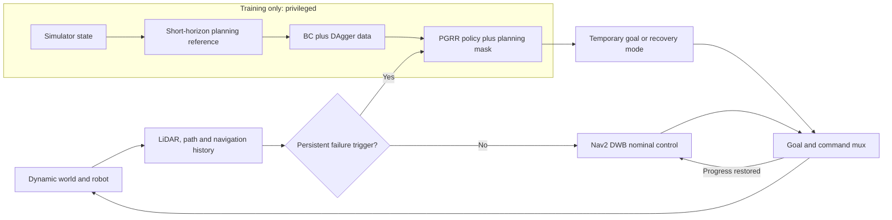

# PGRR: Planning-Guided Failure-Triggered Recovery and Rejoin

PGRR is a failure-triggered recovery layer for dynamic social navigation. A
classical ROS2 navigation stack controls routine PointGoal motion. Learning is
invoked only when observable rules indicate collision risk, freezing,
oscillation, deadlock, or planner failure. The learned policy selects an
interpretable temporary subgoal or recovery mode; it does not continuously
replace the local planner or command base velocity.

The paper title is:

> *Planning-Guided Failure-Triggered Recovery via Imitation Learning for
> Dynamic Social Navigation*

PGRR is introduced in the manuscript as a descriptive project name, not as a
claim of a unique acronym.

> **Evidence status.** The selected release uses a privileged rollout expert,
> Uniform BC, two DAgger aggregation rounds, planning/action masking, an
> observable rule trigger, and an independent safety supervisor. PPO and a
> learned failure detector are not claimed as completed contributions. Final
> paper numbers are accepted only from the complete moderate-v4 five-method
> artifacts under `outputs/moderate/final/`; validation probes and previous
> evaluations are never copied into the paper.

## Method

The recovery action set contains 21 robot-relative temporary goals from three
radii and seven bearings, plus `WAIT`, `BACKUP`, `REPLAN`, and `CONTINUE`. A
planning-derived mask removes occupied, disconnected, occluded, unsafe, or
unavailable actions before selection. A hysteretic state machine saves the
original task goal, executes bounded recovery, and rejoins the original Nav2
route after progress resumes. A stopping-distance supervisor can override both
learned and classical commands. It is an empirical safety filter, not a formal
collision-free guarantee.

During training only, a privileged short-horizon planner rolls out every legal
candidate using simulator robot/pedestrian state and provides imitation labels.
Behavior cloning learns those labels, and DAgger adds labels on states visited
by the learned controller. Deployment uses only LiDAR, path, goal, velocity,
planner-command, progress, status, and rule-score histories.



The vector closed-loop diagram is
[`paper/figures/system_architecture.pdf`](paper/figures/system_architecture.pdf).

## Environments

The verified online runtime is the pinned Arena ROS2 Humble Gazebo fallback
with Jackal, Nav2 DWB, Xvfb, and software rendering. The release does not claim
Flatland, Arena 5, cross-simulator transfer, or hardware validation. Exact
runtime provenance is in
[`third_party/arena_commits.lock`](third_party/arena_commits.lock) and
[`third_party/dependency_manifest.md`](third_party/dependency_manifest.md).

Online and offline environments are deliberately separate:

| Environment | Purpose |
|---|---|
| Arena/ROS2 runtime | Gazebo, Nav2, ROS nodes, online inference, and episode execution |
| `ramp-offline` Conda | Data conversion, expert labeling, BC/DAgger, tests, statistics, figures, and LaTeX |

Never install or source Arena from an active Conda environment. Runtime scripts
remove Conda and foreign ROS variables before starting the pinned Humble stack.

## Installation and build

Run commands from the Git root:

```bash
PROJECT_ROOT="$(git rev-parse --show-toplevel)"
cd "$PROJECT_ROOT"

make preflight
make conda
make arena
make build
make test
```

- `make preflight` writes a non-mutating environment report.
- `make conda` creates or updates `ramp-offline` and dependency locks.
- `make arena` discovers or builds the isolated online runtime without Conda.
- `make build` installs the Python packages and builds the ROS2 overlay.
- `make test` runs Ruff, formatting, mypy, and pytest.

Use [`scripts/bootstrap/activate_offline.sh`](scripts/bootstrap/activate_offline.sh)
for offline work and
[`scripts/bootstrap/source_runtime.sh`](scripts/bootstrap/source_runtime.sh)
for ROS work. Do not source both in the same shell.

## Smoke test

```bash
make smoke SEED=0 HEADLESS=1
```

The smoke test checks bounded startup and cleanup, `/clock`, TF, LiDAR,
odometry, robot spawning, and Nav2 goal submission. Goal acceptance is not an
algorithm-success result.

## Moderate-v4 benchmark

The preregistered benchmark contains eight interaction families:

1. head-on corridor;
2. doorway bottleneck;
3. crossing flow;
4. blind corner;
5. group blocking;
6. overtaking;
7. opposite streams;
8. temporary blockage.

Low, medium, and high density contain one, two, and four pedestrians. Train,
validation, and test use disjoint seed blocks. The held-out
[`moderate_v4_test.yaml`](scenarios/splits/moderate_v4_test.yaml) manifest has
five repetitions per family--density cell: 120 conditions per method.

The publication comparison uses the same 120 conditions for all five methods:

| Runner ID | Paper label | Role |
|---|---|---|
| `base` | DWB | Classical planner without recovery subtree |
| `standard` | Standard | Standard Nav2 recovery behavior |
| `heuristic` | Heuristic | Rule-triggered deterministic recovery |
| `bc_uniform` | Uniform BC | Planning-masked behavior cloning |
| `pgrr` | PGRR | Validation-selected DAgger policy |

The privileged expert is a training and diagnostic planning reference. It is
not a deployment baseline and no optimality claim is made.

## Data and training

```text
Arena episode JSONL
  -> observable / privileged field separation
  -> expert-labelled HDF5 shards
  -> Uniform BC and two DAgger rounds
  -> ONNX / TorchScript deployment
```

Representative commands are:

```bash
make label-expert
make train-bc
make train-dagger DAGGER_ITERATION=1
make train-dagger DAGGER_ITERATION=2
```

The selected deployment checkpoint is
[`checkpoints/dagger/coverage_safety_aligned/best.onnx`](checkpoints/dagger/coverage_safety_aligned/best.onnx).
Margin weighting is retained as a negative offline ablation, not as a claimed
gain. PPO is disabled in the selected method.

## Final evaluation

Lock all validation-selected code and configuration before the held-out run.
Then start the complete five-method test:

```bash
make evaluate-flatland \
  EVALUATION_JOBS=3 \
  EVALUATION_TIMEOUT_S=240 \
  MODERATE_ANALYSIS_DIR=outputs/moderate/final
```

The legacy Make target name is retained for compatibility; it calls the actual
[`run_experiment.py`](scripts/evaluate/run_experiment.py) runner and the pinned
runtime profile. It does not call a nonexistent shell wrapper or silently
switch simulators. The runner refuses overwrite; use its explicit `--resume`
mode directly only after auditing the retained run manifest.

Once all 600 logical method--episodes have an accepted terminal record:

```bash
make statistics
make figures
make tables
make paper
```

The chain is fail-closed:

1. `collect_results.py` verifies the episode and run manifests and retains every
   terminal outcome;
2. `summarize_moderate.py` requires identical condition sets for
   `base standard heuristic bc_uniform pgrr`, with `pgrr` as the main method;
3. the moderate figure/table generators require exactly 120 conditions per
   method;
4. the manuscript imports only `moderate_*` macros, tables, and result figures.

`COLLISION`, `TIMEOUT`, and `PLANNER_FAILURE` remain separate algorithm
outcomes. `SIMULATOR_FAILURE` and `INVALID_RESET` remain counted in the
artifacts and are excluded only according to the declared protocol.

## Reproduce the paper without simulation

After the completed run is present:

```bash
scripts/reproduce_paper.sh
```

This command never launches Arena. It recollects the locked raw streams,
recomputes complete-condition summaries and paired statistics, regenerates the
moderate figures/tables in both publication directories, compiles the anonymous
IEEEtran paper, and writes a checksummed artifact manifest.

Publication figures follow a restrained Robot/Embodied closed-loop style:
white background, 2D vector graphics, three functional color groups at most,
shape/hatch redundancy, and double-column-readable typography. Telemetry media
are explicitly labelled reconstructions; simulator screenshots must come from
an actual captured run and are never synthesized by the paper scripts.

## Authoritative artifact layout

```text
configs/experiments/scenario_catalog_moderate_v4.yaml
configs/planner/baselines.yaml
scenarios/splits/moderate_v4_test.yaml
checkpoints/bc/uniform_scenario/best.onnx
checkpoints/dagger/coverage_safety_aligned/best.onnx
outputs/moderate/final/episode_manifest.parquet
outputs/moderate/final/run_manifest.json
outputs/moderate/final/results.parquet
outputs/moderate/final/summary.csv
outputs/moderate/final/pairwise_statistics.json
outputs/moderate/final/calibration_report.json
outputs/moderate/final/failure_analysis.md
outputs/moderate/final/artifact_manifest.json
outputs/figures/moderate_*.pdf
outputs/tables/moderate_*.tex
paper/generated/moderate_*.tex
paper/figures/moderate_*.pdf
paper/main.pdf
```

If any required moderate artifact is absent or incomplete, `make paper` fails;
old final tables and pilot CSVs are not a fallback. Manuscript claims are mapped
to evidence in
[`paper/claim_evidence_matrix.md`](paper/claim_evidence_matrix.md).

## Limitations

- Known 2D maps, planar LiDAR, and simulation localization are assumed.
- Deterministic actors enable paired replay but do not represent the full
  dynamics, intent, or social norms of real pedestrians.
- The finite action set, rule trigger, and empirical supervisor provide no
  formal collision-avoidance guarantee.
- Closed-loop outcomes combine the detector, mask, policy, Nav2, and supervisor;
  they do not identify a causal contribution for one component.
- PPO, learned failure prediction, cross-simulator transfer, and hardware tests
  are not completed claims.

## Repository map

```text
configs/       platform, planner, failure, training, and experiment definitions
packages/      ROS-independent ramp_core and ramp_ml Python packages
ros_ws/src/    ramp_msgs, ramp_ros, and ramp_bringup
scenarios/     generated scenarios, previews, and split locks
data/          raw episodes, HDF5 shards, and provenance manifests
checkpoints/   BC and DAgger models and metadata
scripts/       bootstrap, Arena, data, training, evaluation, and paper commands
outputs/       validation/final results, figures, tables, logs, and videos
paper/         IEEEtran manuscript, verified references, and generated artifacts
tests/         unit, integration, and deterministic regression tests
```

The retained `ramp_*` package, environment, and metadata identifiers are stable
compatibility interfaces. New documentation and paper prose use PGRR.

## Citation and license

Citation metadata are in [`CITATION.cff`](CITATION.cff). The paper is anonymous
and contains no fabricated venue or DOI; update the citation only after an
archival record exists. Verified references are in
[`paper/references.bib`](paper/references.bib).

The software is distributed under the [BSD 3-Clause License](LICENSE). External
Arena/ROS assets retain their original licenses and pinned provenance.
