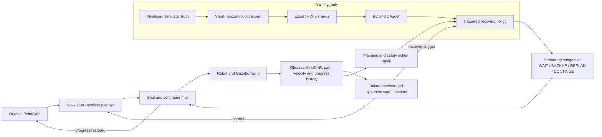

# PGRR: Planning-Guided Failure-Triggered Recovery and Rejoin

PGRR is a failure-triggered recovery layer for dynamic social navigation. A
classical ROS2 navigation stack controls routine PointGoal motion. Learning is
invoked only near collision risk, freezing, oscillation, deadlock, or planner
failure, and it chooses an interpretable temporary subgoal or recovery mode
rather than commanding base velocity continuously.

The repository was developed internally with `ramp_*` package names. PGRR is
the public project and paper name; see [internal package compatibility](#internal-package-compatibility)
before integrating it into another ROS workspace.

> **Evidence status.** The selected release is the imitation-learning path:
> privileged rollout expert, behavior cloning, a completed two-round DAgger
> workflow, and planning/action masking in both labeling and deployment. The
> second-round candidate was retained as a negative validation result; the
> selected checkpoint extends the better first-round aggregate with a
> train-split coverage shard. PPO and the
> learned detector are not claimed as completed contributions. The locked
> 64-episode test is complete. The values below are reproduced from the generated
> [summary CSV](outputs/final/summary.csv) and
> [statistics JSON](outputs/final/statistics.json).

## Method

The recovery action set contains 21 robot-relative temporary goals formed from
three radii and seven bearings, plus `WAIT`, `BACKUP`, `REPLAN`, and `CONTINUE`.
A planning-derived mask removes occupied, disconnected, occluded, unsafe, or
otherwise unavailable actions before selection. A hysteretic state machine
saves the original task goal, executes a bounded recovery option, and rejoins
the original Nav2 route after progress resumes. An independent stopping layer
can override both learned and classical commands; it is an empirical safety
filter, not a formal collision-free guarantee.

During training only, a privileged short-horizon expert rolls out every legal
candidate using simulator robot/pedestrian state and assigns action costs.
Behavior cloning learns from these labels, and DAgger adds expert labels on
states visited by the learned policy. Deployment receives only observable
LiDAR/history/navigation features.



The paper-quality vector version is available as the
[system architecture PDF](paper/figures/system_architecture.pdf).

## Supported release profile

The verified runtime is the pinned **Arena ROS2 Humble Gazebo fallback** using
Jackal, Nav2 DWB, Xvfb, and software rendering. It is not Arena 5.0 and Flatland
is unavailable in this profile. Exact source commits, image identity, binary
packages, and local compatibility patches are recorded in
[the Arena lock](third_party/arena_commits.lock) and the
[dependency manifest](third_party/dependency_manifest.md).

Two Python environments are intentionally kept separate:

| Environment | Purpose | Why it is isolated |
|---|---|---|
| Arena/ROS2 runtime | Gazebo, Nav2, ROS nodes, online inference and episode execution | Uses Ubuntu 22.04, ROS2 Humble, Python 3.10, and the pinned container/runtime paths. Conda paths can silently mix ROS distributions and ABIs. |
| `ramp-offline` Conda | Dataset conversion, expert labeling, BC/DAgger training, tests, statistics, figures and paper compilation | Does not import the apt-installed ROS Python environment. Models and data cross the boundary as HDF5, JSON, Parquet, YAML, ONNX, TorchScript, or checkpoints. |

Never activate Conda while installing or sourcing Arena. Runtime scripts remove
Conda and foreign ROS variables before launching the Humble container.

## Installation and build

Run commands from the checked-out Git root so the repository remains relocatable:

```bash
PROJECT_ROOT="$(git rev-parse --show-toplevel)"
cd "$PROJECT_ROOT"

make preflight
make conda
make arena
make build
make test
```

- `make preflight` records a non-mutating host report under `docs/` and
  `outputs/logs/`.
- `make conda` creates/updates `ramp-offline` from
  [environment.yml](environment.yml) and records dependency locks.
- `make arena` discovers or builds the pinned isolated Humble/Gazebo runtime;
  it does not install ROS into Conda.
- `make build` installs the local Python packages and builds the three-package
  ROS2 overlay.
- `make test` runs Ruff, formatting, mypy, and pytest in the offline environment.

For offline-only work, the explicit activation helper is
[`scripts/bootstrap/activate_offline.sh`](scripts/bootstrap/activate_offline.sh).
For ROS work, use
[`scripts/bootstrap/source_runtime.sh`](scripts/bootstrap/source_runtime.sh)
from a shell without an active Conda environment.

## Smoke test

```bash
PROJECT_ROOT="$(git rev-parse --show-toplevel)"
cd "$PROJECT_ROOT"
make smoke SEED=0 HEADLESS=1
```

The smoke test checks process startup, `/clock`, TF, planar LiDAR, odometry,
robot spawning, Nav2 goal submission, and bounded cleanup. Goal acceptance in a
smoke test is not counted as navigation success; algorithm outcomes are produced
only by the episode runner and logger.

## Scenarios and splits

The deterministic catalog contains eight families:

1. head-on corridor;
2. doorway bottleneck;
3. crossing flow;
4. blind corner;
5. group blocking;
6. overtaking;
7. opposite streams;
8. temporary blockage.

Each family has low, medium, and high density variants in disjoint
[`train`](scenarios/splits/train.yaml),
[`validation`](scenarios/splits/validation.yaml), and
[`test`](scenarios/splits/test.yaml) manifests. Scenario JSON files and preview
images are generated from the checked-in catalog with explicit seeds:

```bash
PROJECT_ROOT="$(git rev-parse --show-toplevel)"
cd "$PROJECT_ROOT"
make scenarios SEED=0
```

Do not edit test scenarios or hashes after final evaluation is frozen.

## Data and training

The principal data path is:

```text
Gazebo episode JSONL
  -> observable/privileged separation and failure labels
  -> expert-labelled HDF5 shards
  -> BC or DAgger checkpoint
  -> ONNX/TorchScript deployment
```

Representative commands are:

```bash
PROJECT_ROOT="$(git rev-parse --show-toplevel)"
cd "$PROJECT_ROOT"

make label-expert
make train-bc
make train-dagger DAGGER_ITERATION=1
make train-dagger DAGGER_ITERATION=2
```

Inputs and output paths can be overridden through the variables documented by
`make help`. Dataset manifests record split, scenario, seed, source policy,
project commit, and source hashes. Five-frame LiDAR stacks are created by the
dataset loader instead of duplicating frames on disk.

The frozen learned method is named **Triggered-DAgger** in the paper. Its
stable release entry point is
[`checkpoints/final/best.onnx`](checkpoints/final/best.onnx), which links to the
selected validation checkpoint under `checkpoints/dagger/coverage_safety_aligned`.
For compatibility with existing launch files and raw logs, its internal
`source_policy`/runner method is `bc`. Margin weighting is retained as a negative
ablation, and PPO is disabled in the locked
[`ei_gazebo.yaml`](configs/final/ei_gazebo.yaml) configuration.

## Locked 64-episode test

The test manifest has 24 scenarios: eight families by three densities. The
primary comparison runs Base DWB and Triggered-DAgger on all 24 scenarios
(48 logical episodes). Standard and heuristic recovery run on the eight
high-density scenarios (16 more), giving **64 logical episodes**. A retry after
`SIMULATOR_FAILURE` or `INVALID_RESET` is an infrastructure attempt and is not
silently converted into an additional algorithm episode.

The complete command and resume rules are in
[REPRODUCIBILITY.md](REPRODUCIBILITY.md). The runner records scenario hashes,
checkpoint hash, Git commit, worker isolation, outcomes, exclusions, and the
shared [episode manifest](outputs/final/episode_manifest.parquet).

### Verified final result

| Method and scope | Success | Collision | Timeout |
|---|---:|---:|---:|
| DWB, all 24 conditions | 20.8% | 79.2% | 0.0% |
| PGRR, all 24 conditions | 33.3% | 0.0% | 66.7% |
| Standard recovery, 8 high-density conditions | 12.5% | 87.5% | 0.0% |
| Heuristic hierarchy, 8 high-density conditions | 12.5% | 0.0% | 87.5% |

In the 24 paired DWB--PGRR conditions, the collision-rate difference is
-79.2 percentage points (95% paired bootstrap CI [-91.7, -62.5],
Holm-adjusted exact McNemar `p < 0.001`). The timeout-rate difference is +66.7
points ([45.8, 83.3], `p < 0.001`). The observed success-rate difference is
+12.5 points ([0.0, 29.2]) but is not significant after correction
(`p = 0.750`). PGRR therefore demonstrates a strong empirical
collision-avoidance effect in this manifest while exposing conservative
live-lock; it does not establish universal navigation improvement.

The runner executed 67 physical attempts for 64 logical episodes. Two
`INVALID_RESET` attempts and one `SIMULATOR_FAILURE` attempt are retained in the
run manifest and excluded from algorithm rates only after successful retries.
Each family--density cell still has one test seed, so family results are broad
condition coverage rather than low-variance estimates.

The generated [failure analysis](outputs/final/failure_analysis.md) separates
human/static contacts from terminal stagnation. A representative successful
triggered episode is available as
[telemetry keyframes](outputs/figures/crossing_flow_high_test_s03220_eval_bc_a0_dwb_telemetry_keyframes.png)
and an [MP4 reconstruction](outputs/videos/crossing_flow_high_test_s03220_eval_bc_a0_dwb_telemetry.mp4).
These are reconstructed from recorded physical poses and explicitly are not a
simulator camera feed.

## Statistics, figures, and paper

After every logical episode has one valid algorithm outcome:

```bash
PROJECT_ROOT="$(git rev-parse --show-toplevel)"
cd "$PROJECT_ROOT"

make statistics
make figures
make tables
make paper
```

Statistics use paired episodes, bootstrap confidence intervals, McNemar tests
for paired binary outcomes, Wilcoxon signed-rank tests for continuous outcomes,
effect sizes, and Holm correction. `SIMULATOR_FAILURE` and `INVALID_RESET` are
reported separately and excluded only according to the frozen protocol.

The generated paper is [paper/main.pdf](paper/main.pdf). Tables and figures are
generated from machine-readable results; manuscript claims are traced to files
in the [claim--evidence matrix](paper/claim_evidence_matrix.md). Do not copy a
number from a pilot log into the paper or README.

## Result and artifact layout

The authoritative final values are generated, not manually transcribed:

```text
configs/final/ei_gazebo.yaml             locked experiment definition
checkpoints/dagger/coverage_safety_aligned/
checkpoints/final/                         stable links to the frozen checkpoint
outputs/final/episode_manifest.parquet   shared logical-episode manifest
outputs/final/run_manifest.json          commit, hashes, retries and completion
outputs/final/results.parquet            episode-level metrics
outputs/final/summary.csv                report-ready descriptive summary
outputs/final/statistics.json            paired tests, CIs and exclusions
outputs/final/failure_analysis.md        retained failure taxonomy and examples
outputs/final/artifact_manifest.json      artifact hashes and provenance
outputs/figures/                          generated analysis figures
outputs/tables/                           generated LaTeX tables
paper/generated/                          tables consumed by the manuscript
paper/main.pdf                            compiled anonymous manuscript
```

Use the [summary CSV](outputs/final/summary.csv) for final numerical results and
the [statistics JSON](outputs/final/statistics.json) for inferential claims. If
either file is absent, the final evaluation is incomplete; pilot CSVs are not a
replacement.

## What has been verified

- The pinned Humble/Gazebo runtime starts headlessly and exposes clock, TF,
  LiDAR, odometry, Jackal, and Nav2 goal interfaces.
- Train/validation/test scenario manifests are disjoint and SHA-locked.
- Rule detection, the recovery state machine, offline/online action masking,
  privileged expert, BC, and two DAgger aggregation rounds have executable code
  and regression tests.
- Selected checkpoints are exported to PyTorch, TorchScript, and ONNX; masked
  deployment rejects invalid actions by construction while a legal fallback
  remains.
- The locked 64-episode Gazebo evaluation is complete. PGRR executes temporary
  subgoals and rejoins the original goal in successful triggered runs, eliminates
  observed terminal contacts in the primary manifest, and also produces many
  timeouts; both sides of that trade-off are retained.
- Figures, LaTeX tables, bibliography, and the IEEEtran manuscript compile from
  repository artifacts.

Current evidence and unresolved gates are maintained in
[CURRENT_STATUS.md](CURRENT_STATUS.md), while design changes and rejected ideas
are recorded in [DECISIONS.md](DECISIONS.md).

## Limitations

- The verified platform is the Arena Humble Gazebo fallback, not Flatland,
  Arena 5.0, or hardware.
- Pedestrians in the fallback are LiDAR-visible, contactless simulation actors;
  they do not reproduce the full dynamics and intent of real crowds.
- The method assumes a known 2D map, planar LiDAR, and simulation pose-derived
  localization.
- The privileged expert uses simulator truth and short-horizon motion prediction
  during training; the discrete action set cannot express arbitrary maneuvers.
- The selected offline labeler and Heuristic baseline interpret the 180-bin scan
  with a legacy 270-degree calibration even though the recorded sensor spans
  360 degrees. The online PGRR mask uses correct scan metadata; this locked
  mismatch is disclosed in the paper and was not repaired after test inspection.
- The safety supervisor is empirical and provides no formal collision guarantee.
- Recurrent flows, blind corners, and narrow bottlenecks can still produce
  collisions, timeouts, or conservative stagnation.
- PPO, the learned multi-task detector, broad Gazebo transfer, and real-robot
  validation are not completed claims in this release.
- Final effectiveness must be judged from the locked 64-episode artifacts, not
  from development pilots or individual videos.

## Internal package compatibility

The public rename deliberately does not break import paths, ROS package names,
recorded topics, checkpoints, or teaching material:

| Public concept | Retained internal identifier |
|---|---|
| PGRR core algorithms | `ramp_core` |
| PGRR learning code | `ramp_ml` |
| ROS integration | `ramp_ros` |
| ROS messages/services | `ramp_msgs` |
| Bringup | `ramp_bringup` |
| Offline Conda environment | `ramp-offline` |
| Runtime variables and raw metadata | `RAMP_*` / `ramp_*` |

These identifiers are compatibility interfaces, not a second method name. New
documentation and paper text should use PGRR; code consuming the release should
continue importing `ramp_core` and `ramp_ml`.

## Repository map

```text
configs/       platform, planner, detector, expert, training and final configs
packages/      ROS-independent ramp_core and ramp_ml Python packages
ros_ws/src/    ramp_msgs, ramp_ros and ramp_bringup ROS2 packages
scenarios/     generated scenarios, previews, manifests and split locks
data/          raw episodes, HDF5 shards and provenance manifests
checkpoints/   BC and DAgger models and training metadata
scripts/       bootstrap, Arena, data, training, evaluation and paper commands
outputs/       pilot/final results, figures, tables, logs and videos
paper/         IEEEtran manuscript, verified references and generated content
tests/         unit, integration and deterministic regression tests
```

## Citation and license

Citation metadata are provided in [CITATION.cff](CITATION.cff). The manuscript
is anonymous and has no fabricated venue or DOI; replace the citation with the
archival record when one exists. Verified related-work records are in
[`paper/references.bib`](paper/references.bib).

The software is distributed under the [BSD 3-Clause License](LICENSE). External
Arena/ROS assets retain their original licenses and pinned provenance.
