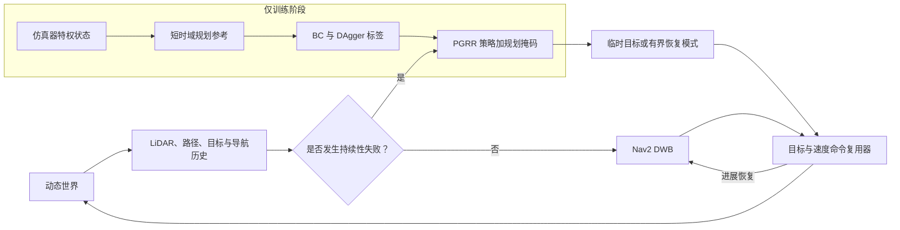

# PGRR：面向动态社会导航的规划引导、失败触发式恢复与重返

PGRR 是一个用于动态社会导航的**失败触发式恢复层**。在正常的 PointGoal 导航中，Nav2 DWB 仍负责控制；只有当可观测规则检测到碰撞风险、卡死（freezing）、振荡、死锁或规划器失败时，PGRR 才会启动。它会选择一个可解释的临时子目标或受限的恢复模式，并在恢复后让机器人回到原来的路线。

本仓库只提供**一个受支持的最终发布版本**。`moderate_social_navigation_v6` 仍保留在场景 ID 和清单中，因为它是已评估数据集不可变的身份标识，而不是第二个软件或算法版本。历史上的 `ramp_*` 与 `RAMP_*` 名称仅用于兼容既有接口；公开的方法名称为 PGRR。

## 最终发布概览

- 冻结运行：`95ec74c511bb`，评估提交为 `6916e7cd586acfbe200045e49b093039e2a6980e`。
- 完整证据：600/600 个逻辑 episode；五种方法；每种方法在 120 个完全相同的留出条件上评估。
- 选定模型：[`checkpoints/final/best.onnx`](checkpoints/final/best.onnx)，即由验证集选出的 DAgger 检查点。
- 论文：[`paper/main.pdf`](paper/main.pdf)，恰好 8 页。
- 技术报告：[`report/PGRR_technical_report_zh.pdf`](report/PGRR_technical_report_zh.pdf)，恰好 32 页。
- 演示文稿：[`presentation/PGRR_report_zh.pptx`](presentation/PGRR_report_zh.pptx) 及其 [PDF](presentation/PGRR_report_zh.pdf)，恰好 30 张带插图的幻灯片/页面，其中包含带来源说明的 DWB、BC、DAgger 解释和真实运行证据。
- 带校验和的发布包：[`outputs/moderate/final/artifact_manifest.json`](outputs/moderate/final/artifact_manifest.json)，绑定 96 个产物，包含可复现的算法图源文件。

| 方法 | 到达目标 | 碰撞 | 超时 | 规划器失败 |
|---|---:|---:|---:|---:|
| 基础 DWB | 85 | 35 | 0 | 0 |
| 标准 Nav2 恢复 | 81 | 39 | 0 | 0 |
| 启发式恢复 | 100 | 1 | 6 | 13 |
| 均匀 BC | 104 | 1 | 5 | 10 |
| **PGRR** | **109** | **0** | **2** | **9** |

在 120 个配对的 Base--PGRR 条件上，PGRR 将到达目标的比例提高了 20.00 个百分点（109/120 对比 85/120；经全局 Holm 校正的 McNemar `p=1.031e-4`），并将碰撞率降低了 29.17 个百分点（0/120 对比 35/120；全局 Holm `p=2.561e-9`）。超时差异为 +1.67 个百分点，且全局 Holm `p=1`；规划器失败差异为 +7.50 个百分点，仅作描述性报告，因为该终止类别不是预先注册的推断性终点。

这种改进存在代价。在 83 对双方均成功的配对中，PGRR 慢了 15.88 秒、路径长了 1.89 米，且角加加速度（angular jerk）更高。PGRR 与启发式方法、均匀 BC 在三个预先注册的终止终点（到达目标、碰撞和超时）上的观测差异，经全局校正后均不显著；规划器失败只作描述性报告，未进行事后检验。因此，本文支持的结论是：PGRR 相对基础 DWB 带来了安全性和完成率的提升，但伴随效率与平滑性的权衡；它并不意味着 PGRR 在所有社会导航情境下都更优。

## 系统

恢复动作集合由 21 个机器人相对坐标系中的临时目标组成（来自三种半径和七个方位），另加 `WAIT`（等待）、`BACKUP`（后退）、`REPLAN`（重新规划）和 `CONTINUE`（继续）。一个从规划导出的掩码会移除不安全、被占用、不连通、被遮挡或不可用的选项。一个带滞回的状态机保存原始任务目标，执行有界恢复，并在稳定脱离危险且任务有进展后重新加入 Nav2 路线。独立的制动距离监督器可以覆盖学习策略和经典控制器的命令；它是经验性过滤器，并非形式化安全保证。



部署时，PGRR 仅使用 LiDAR、路径、目标、速度、规划器命令、进度、状态以及规则得分历史。机器人/行人的仿真真值仅限于训练专家和评估字段使用。PPO 和学习式失败检测器不是已完成的贡献。

系统架构图和恢复状态图分别为 [`paper/figures/system_architecture.pdf`](paper/figures/system_architecture.pdf) 与 [`paper/figures/recovery_state_machine.pdf`](paper/figures/recovery_state_machine.pdf)。

## 基准与对比方法

最终留出基准包含八类动态交互场景：走廊迎面相遇、门口瓶颈、交叉流、盲角、群体阻塞、超越、对向人流和临时阻塞。每类场景均含低、中、高三种密度，五个留出重复实验使每种方法共有 120 个相同条件键。

| 运行器 ID | 论文标签 | 角色 |
|---|---|---|
| `base` | 基础 DWB | 不含恢复子树的经典规划器 |
| `standard` | 标准 | 标准 Nav2 恢复行为 |
| `heuristic` | 启发式 | 由可观测规则触发的恢复 |
| `bc_uniform` | 均匀 BC | 带规划掩码的行为克隆 |
| `pgrr` | PGRR | 由验证集选出的 DAgger 恢复策略 |

训练、验证和测试按场景 ID 与随机种子划分，绝不按帧划分。在配置、编译场景、检查点、运行环境、时间上限、并发度和接受的校准哈希均被提交之前，测试集一直保持封存。最终测试现已永久冻结，不能用于调参。

## 真实环境与运行对比

本发布版本包含完成项目所需的两类证据：

- [真实 Arena Gazebo GUI 截图](paper/figures/runtime_gazebo_doorway_bottleneck_medium.png)，及其[像素/运行时元数据](outputs/figures/runtime/gazebo_doorway_bottleneck_medium.metadata.json)和[窗口来源记录](outputs/figures/runtime/gazebo_doorway_bottleneck_medium.window.json)。它展示了 Ubuntu 22.04、ROS2 Humble、Arena Gazebo、Jackal、Nav2 DWB、平面 LiDAR 和动态智能体。它被如实标注为历史 moderate-v5 验证环境截图（基准来源证据，而非另一个当前发布版本），并非来自留出统计实验的相机帧。
- 从真实、相同条件的留出配对重建的[Base--PGRR 匹配轨迹](outputs/moderate/final/media/moderate_matched_base_pgrr_trajectory.pdf)和 [PGRR 恢复时间线](outputs/moderate/final/media/moderate_pgrr_recovery_timeline.pdf)，并与原始/结果哈希绑定。这些是遥测重建图，而不是截图。
- [代表性遥测关键帧](outputs/moderate/final/media/pgrr_representative_telemetry_keyframes.pdf)和[视频](outputs/moderate/final/media/pgrr_representative_telemetry.mp4)，也明确标注为遥测数据。

论文、报告和幻灯片除说明性示意图外，还包含真实结果表和配对比较。

## 环境

在线与离线环境被刻意分离：

| 环境 | 用途 |
|---|---|
| Ubuntu 22.04 / ROS2 Humble / 固定版本 Arena Gazebo | Jackal、Nav2、仿真、在线推理和 episode 执行 |
| Python 3.10 Conda `ramp-offline` | 数据、专家标签、BC/DAgger、测试、统计、绘图和 LaTeX |

Gazebo 配置使用确定性的、LiDAR 可见的圆柱形行人代理。它们可实现可复现的配对交互，但不是经过验证的人类意图模型。精确的第三方来源记录在 [`third_party/arena_commits.lock`](third_party/arena_commits.lock) 与 [`third_party/dependency_manifest.md`](third_party/dependency_manifest.md) 中。

绝不要在激活 Conda 环境时安装或 source Arena。运行时辅助脚本会移除 Conda 和外来 ROS 环境变量；离线辅助脚本不会 source ROS。

## 安装、构建和测试

在 Git 根目录执行：

```bash
PROJECT_ROOT="$(git rev-parse --show-toplevel)"
cd "$PROJECT_ROOT"

make preflight
make conda
make arena
make build
make test
```

- `make preflight`：记录不修改系统的环境报告。
- `make conda`：创建或更新隔离的离线环境并生成锁定文件。
- `make arena`：准备隔离且版本固定的在线 Arena 运行时。
- `make build`：安装 Python 包并构建 ROS2 覆盖工作空间。
- `make test`：运行 Ruff、格式检查、mypy 和 pytest。

有限的运行时检查：

```bash
make smoke SEED=0 HEADLESS=1
```

smoke 中目标被接受仅是基础设施检查，不是算法成功。

## 数据与训练

```text
Arena episode JSONL
  -> 可观测字段/特权字段分离
  -> 带专家标签的 HDF5 分片
  -> 均匀 BC
  -> 两轮 DAgger 和验证集选择
  -> 最终 ONNX 检查点
  -> 五种方法的闭环评估
```

代表性的训练目标为：

```bash
make label-expert
make train-bc
make train-dagger DAGGER_ITERATION=1
make train-dagger DAGGER_ITERATION=2
```

被选中的检查点为 [`checkpoints/dagger/coverage_safety_aligned/best.onnx`](checkpoints/dagger/coverage_safety_aligned/best.onnx)，同时以 `checkpoints/final/best.onnx` 的形式暴露。第二个 DAgger 候选模型和 margin weighting 均被保留为验证集/离线阶段的负面结果，而没有被悄然提升为最终模型。

## 不运行仿真地复现发布版本

默认的论文重建仅使用已提交的最终结果包：

```bash
PGRR_RELEASE_MODE=0 PGRR_RECOLLECT_RAW=0 \
scripts/reproduce_paper.sh
```

它不会启动 Arena，也不会打开 `data/raw`。它会验证已发布的 600 行输入，重新生成结果相关产物，构建 8/32/30 页文档，并创建候选产物清单。

提交完整候选版本后，可从干净的 checkout 验证：

```bash
PGRR_RELEASE_MODE=1 PGRR_RECOLLECT_RAW=0 \
scripts/reproduce_paper.sh
```

发布模式不重新生成任何内容。它检查科学来源、全部 96 个产物路径/大小/SHA256、标准媒体哈希、页数、最终论文文本、报告/PPT 数据结构和隐私；之后 checkout 必须保持不变。字体嵌入在开发阶段的文档构建中检查，生成的 PDF 随后在发布模式中由哈希绑定。完整命令见 [`REPRODUCIBILITY.md`](REPRODUCIBILITY.md) 和 [`COMMANDS.md`](COMMANDS.md)。

600-episode 仿真已经完成。如要有意进行独立复跑，必须在冻结评估提交的新干净工作树中执行，并使用新的空输出目录：

```bash
git worktree add ../PGRR-evaluation-reproduction \
  6916e7cd586acfbe200045e49b093039e2a6980e
cd ../PGRR-evaluation-reproduction
make verify-calibration
test ! -e outputs/moderate/independent_reproduction
make evaluate-final \
  MODERATE_ANALYSIS_DIR=outputs/moderate/independent_reproduction
```

算法结果（`GOAL_REACHED`、`COLLISION`、`TIMEOUT` 和 `PLANNER_FAILURE`）绝不重跑。只有被明确分类为 `SIMULATOR_FAILURE` 和 `INVALID_RESET` 的尝试允许重试，且每一次物理执行尝试都会保留在运行来源记录中。

## 权威最终目录结构

```text
configs/final/ei_gazebo.yaml
configs/experiments/scenario_catalog_moderate_v6.yaml
scenarios/splits/moderate_v6_test.yaml
checkpoints/final/best.onnx
outputs/moderate/v6_validation_base_d5fa66b/calibration_report.json
outputs/moderate/final/
  episode_manifest.parquet
  run_manifest.json
  results.parquet
  summary.csv
  pairwise_statistics.json
  failure_analysis.md
  matched_base_pgrr_evidence.json
  artifact_manifest.json
  media/
paper/main.pdf
report/PGRR_technical_report_zh.pdf
presentation/PGRR_report_zh.pptx
presentation/PGRR_report_zh.pdf
```

只有 `outputs/moderate/final/` 可用于最终结果声明。pilot、smoke、校准、验证和历史目录不能为最终表或图提供数据。上文显式指定接受的校准报告，是因为存在一个同名但已拒绝的空测试阶段副产物，不能作为证据。

## 仓库地图

```text
configs/       最终运行时、规划器、失败检测、训练和基准输入
packages/      与 ROS 无关的核心和机器学习 Python 包
ros_ws/src/    ROS 消息、节点与启动配置
scenarios/     已编译场景、预览、清单和数据划分锁定文件
data/          原始/中间数据及来源记录（大型原始流被忽略）
checkpoints/   BC/DAgger 模型和元数据
scripts/       引导、Arena、数据、训练、评估与发布工具
outputs/       最终证据、图、表、日志和保留的审计结果
paper/         IEEE 论文和自动生成的素材
report/        中文详细技术报告
presentation/  PPTX/PDF、演讲备注和联系表
tests/         单元测试、集成测试和确定性回归测试
```

## 局限性

- 评估领域只使用一个已知地图族、平面 LiDAR、仿真定位、确定性的智能体路线和一种经典规划器。
- 25 个动作、可观测触发器和经验性监督器不提供形式化的无碰撞保证。
- 闭环结果同时受触发器、掩码、学习策略、Nav2、仿真器和监督器影响；它们无法识别某一个保护机制的因果贡献。
- PPO、学习式检测器、Flatland、Arena 5、第二个规划器、跨仿真器迁移、硬件、人体受试验证和形式化安全均不是已完成的结论。
- 冻结测试集不能再用于算法或阈值选择。

## 历史审计边界

科学透明性要求保留一项简要的早期边界。一次冻结的 64/64 审计记录：在 24 个 Base--PGRR 配对中，PGRR/Base 的碰撞为 0/24 对 19/24，超时为 16/24 对 0/24，到达目标为 8/24 对 5/24；经校正后，到达目标比较不显著。该安全性--完成率权衡不是 v6 的结果，绝不会与最终 600-episode 证据合并。之后一个验证候选在测试开启前也被拒绝，因为 Base 超过了预先注册的校准上限。完整细节保留在 Git 历史和不可变清单中，而不会被展示成多个当前项目版本。

## 分支、引用与许可证

`main` 是规范性的发布分支，`home` 是同步镜像，二者均指向相同的最终项目状态。已发布的证据绝不会被强制重写。

引用元数据位于 [`CITATION.cff`](CITATION.cff)，已验证的参考文献位于 [`paper/references.bib`](paper/references.bib)。软件采用 [BSD 3-Clause License](LICENSE) 发布，而第三方 Arena/ROS 资源继续遵循其原始许可证。
