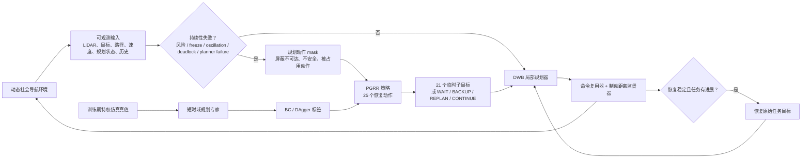
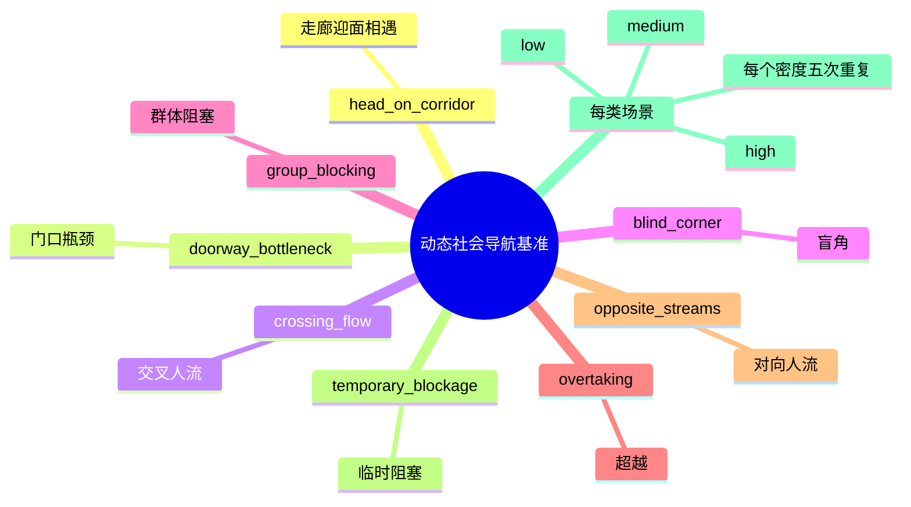
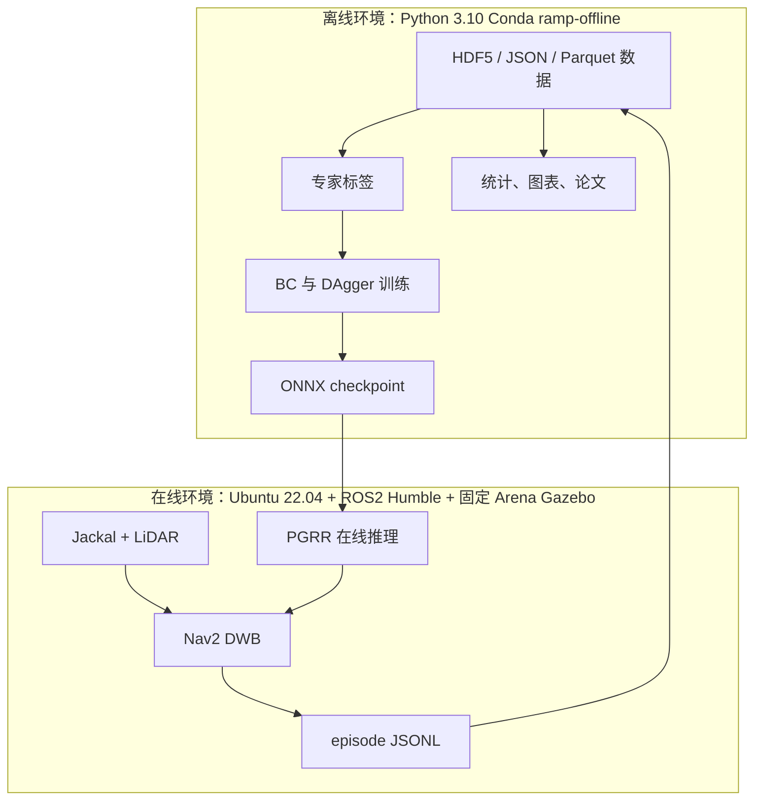

# PGRR 算法、场景与仿真设置示意图（初稿）

这些图是可编辑 Mermaid 源码。它们基于仓库的最终配置和 README；不是仿真截图，也不包含新实验结果。

## 图 1：算法框架

## 图 2：最终基准的任务场景空间

最终冻结基准：`8 类 × 3 种密度 × 5 次重复 = 每种方法 120 个条件`。新扩展场景必须建立新的训练/验证/测试划分，不能重用冻结测试集进行调参。

## 图 3：在线/离线环境边界

关键规则：不要在激活 Conda 时安装或 source Arena；不要在离线测试 shell 中 source ROS。
