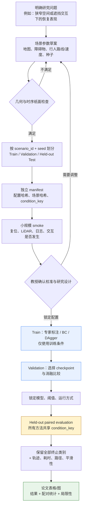

# 作业三：从新增场景到论文证据的实验流程图

日期：2026-08-28  
状态：流程图源稿和写作说明；不启动正式训练、评测或修改现有最终结果。

## 1. 一张可放入汇报的流程图

## 2. 图中最重要的三条逻辑

1. **先定义问题，再造场景。** 例如“门口群体阻塞下等待和横向逃离如何权衡”是问题；门宽、人数和驻留时间才是可控制的自变量。
2. **Validation 是选择环节，Held-out Test 是报告环节。** checkpoint、阈值、是否加入某场景族，都必须在打开新测试之前决定。
3. **方法必须配对。** 同一个 `condition_key` 下，Base、Standard、Heuristic、Uniform BC、PGRR 面对完全相同的机器人起终点、障碍物、行人和 seed。这样差异才较少受场景随机性的干扰。

## 3. 每个阶段应留下什么可用于论文的材料

| 阶段 | 应保存的材料 | 写进论文时的作用 |
|---|---|---|
| 场景设计 | 参数表、地图图、静态/动态几何说明 | 任务与仿真设置图 |
| 划分与 manifest | scenario ID、seed、split、哈希 | 可复现性和避免数据泄漏 |
| smoke | 仅基础设施日志 | 证明运行链路正常，不报告算法效果 |
| 训练与验证 | 训练配置、学习曲线、验证指标、被选 checkpoint | 解释模型选择过程 |
| 保留测试 | 每一条 episode 结果与 terminal reason | 主结果表与 paired statistics |
| 失败分析 | 代表轨迹、恢复动作序列、失败类别统计 | 解释“为什么有效/何时失效” |

## 4. 对论文表述的约束

- 新场景 smoke 或训练曲线不能写成“方法优于基线”的证据；只有锁定后配对测试才可以支撑该类结论。
- 如果 PGRR 更安全但更慢，应同时报告安全、完成率、耗时、路径长度与平滑性，不能只展示有利指标。
- DAgger 的后续候选在验证中较不理想时，正确表述是“该候选未被验证选择”；不能只凭一次结果直接断言它已经过拟合。
- 论文应说明模拟行人是确定性、LiDAR 可见的代理，而不把结果扩展为真实人群行为结论。

## 5. 与现有 PGRR 最终发布的关系

这套流程是为**未来独立扩展实验**准备的。现有发布中的
`outputs/moderate/final/`、`checkpoints/final/best.onnx` 和
`moderate_v6` 测试集保持只读；新实验须使用新 benchmark ID、新输出目录和单独 manifest。
